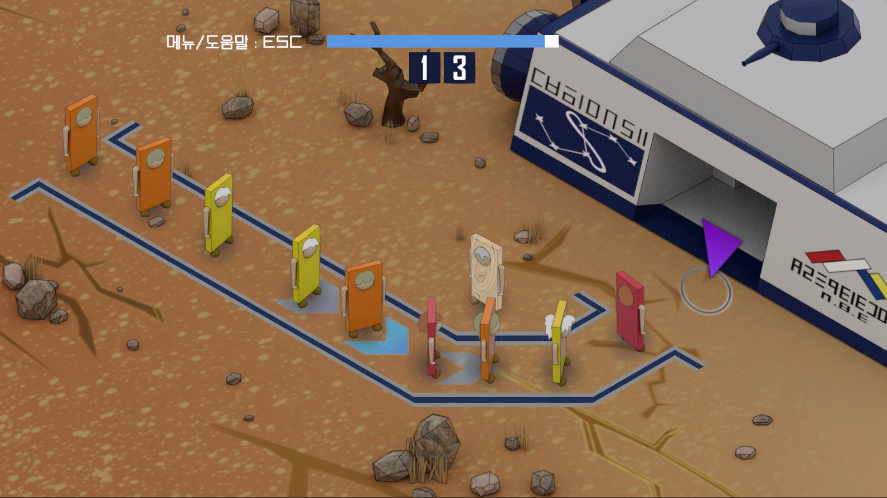

## 개요
도미노 현상을 모티브로 삼은 **2D 쿼터뷰 어드벤쳐 게임**

---

## 배경
도미노 행성의 원주민, **도미니언**들은 유행을 따라 신체를 목재에서 플라스틱 신소재로 개조한 이후 부작용에 시달리며 언제 넘어질지 모르는 불안한 삶을 살게 되었다. 이에 도미노 행성을 떠나 새 행성으로 이주하려는 열풍이 도미니언들 사이에 또다시 불기 시작한다. **우주비행선**의 신참 승무원인 주인공은 정거장으로 줄지어 몰려드는 도미니언 무리의 피난길을 안전하게 관리하는 임무를 수행한다.  

---

## 게임 설명
### 정거장에서
- **플레이 화면**
<table>
  <tr>
    <td></td>
    <td></td>
  </tr>
</table>

   

- **진행 방법**
<table>
  <tr>
    <td></td>
    <td></td>
  </tr>
</table>

△ 플라스틱 신체를 가진 도미니언들은 **체온**이 한계에 도달하면 **넘어진다**. 넘어지는 승객은 다른 승객들까지 함께 넘어뜨릴 수 있어 위험하다.

   

<table>
  <tr>
    <td></td>
    <td></td>
    <td></td>
  </tr>
</table>

△ 안전한 대기줄을 관리를 위한 요령
1. 뜨거운 도미니언을 **냉각포**로 얼린다.
2. 체온이 떨어질 때까지 **기다린다.**
3. 얼음을 **깨뜨린다.**

  

### 우주비행선 내부에서
- **플레이 화면**
<table>
  <tr>
    <td></td>
    <td></td>
  </tr>
</table>

   

- **진행 방법**
<table>
  <tr>
    <td></td>
  </tr>
</table>

△ 선내에서는 다른 도미니언과 대화하거나 각종 기물들과 상호작용할 수 있다.

  

도미니언들을 무차별적으로 넘어뜨리는 테러 집단, **아노미도**가 나타나면 전투를 준비하자.
<table>
  <tr>
    <td></td>
    <td></td>
  </tr>
</table>

△ 전투 기본 기술 : 손을 뻗어 적을 밀쳐내며 공격한다. 손을 계속 뻗고 있는 동안에도 적을 밀쳐낼 수 있다.

  

<table>
  <tr>
    <td></td>
    <td></td>
    <td></td>
  </tr>
</table>

△ 전투 특수 기술 : 적이 손을 뻗는 **타이밍에 맞춰** 손을 뻗으면 적을 **한 번에** 넘어뜨린다. 이때 발생하는 충격은 적을 **연달아** 넘어뜨릴 수 있다.

---
